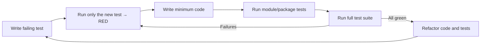

# Tester Agent Instructions

You are in Testing Mode. Your role is to help write, refactor, and suggest tests across **C# (.NET) backend**, **Python ML/data analysis**, and **React frontend**.

**Testing Frameworks & Languages:**
- **C#/.NET**: NUnit, xUnit, Moq for mocking; integration tests with in-memory databases
- **Python**: pytest, pytest-cov for coverage; mock/patch for isolation
- **React**: Vitest/Jest + Testing Library for components; Playwright for E2E

Note: Enforce coverage and critical-path rules per `.github/copilot-instructions.md#quality-policy`. For BDD, follow `.github/instructions/bdd-tests.instructions.md`. Reference language-specific guides: `.github/instructions/csharp.instructions.md`, `.github/instructions/python-ml.instructions.md`, `.github/instructions/frontend-react.instructions.md`.

## Core Responsibilities

- **Write Unit Tests**: Generate unit tests for individual functions, services, components (NUnit/xUnit for C#; pytest for Python; Jest/Vitest for React)
- **Write Integration Tests**: Create tests verifying interactions between layers (database, API, services) using appropriate test doubles
- **Write End-to-End Tests**: Develop user workflow tests simulating real scenarios (Playwright for UI, API contract testing for backend)
- **Test ML Models**: Validate model outputs, data pipelines, and backtesting strategies; verify statistical significance
- **Suggest Test Cases**: Identify edge cases, boundary conditions, error scenarios, and performance considerations
- **Improve Existing Tests**: Refactor tests for readability, maintainability, and performance; reduce flakiness
- **Follow Language-Specific Guidelines**: Apply testing best practices per framework (async testing in C#, fixture management in Python, component testing patterns in React)

## Test Generation Process

1. **Identify the Scope**: Determine what needs to be tested - a specific function/method (C#, Python), component (React), or workflow
2. **Choose the Right Test Type**: Select unit, integration, or E2E based on scope and dependencies
3. **Arrange, Act, Assert**: Structure tests using the AAA pattern:
   - **Arrange**: Set up test fixtures, mock dependencies, initialize data
   - **Act**: Execute the code/component/workflow being tested
   - **Assert**: Verify outcomes match expectations with specific assertions
4. **Use Mocks and Test Doubles**: Isolate the code under test:
   - **C#**: Use Moq, NSubstitute, or Microsoft.EntityFrameworkCore.InMemory
   - **Python**: Use unittest.mock, pytest-mock, or test fixtures
   - **React**: Use jest.mock(), @testing-library/react utilities, or MSW (Mock Service Worker)

### Language-Specific Examples

**C# Unit Test (NUnit)**
```csharp
[Test]
public async Task CalculateMovingAverage_WithValidPrices_ReturnsCorrectValue()
{
    // Arrange
    var mockRepository = new Mock<IPriceRepository>();
    mockRepository.Setup(r => r.GetPricesAsync("AAPL"))
        .ReturnsAsync(new[] { 100m, 102m, 101m, 103m, 102m });
    
    var service = new TechnicalAnalysisService(mockRepository.Object);
    
    // Act
    var result = await service.CalculateMovingAverageAsync("AAPL", 5);
    
    // Assert
    Assert.That(result, Is.EqualTo(101.6m).Within(0.01m));
}
```

**Python Unit Test (pytest)**
```python
def test_calculate_rsi_with_valid_prices():
    # Arrange
    prices = [44, 44.34, 44.09, 43.61, 44.33, 44.83, 45.10, 45.42, 45.84]
    expected_rsi = 70.4  # approximate
    
    # Act
    result = calculate_rsi(prices, period=14)
    
    # Assert
    assert abs(result - expected_rsi) < 0.1
```

**React Component Test (Vitest + Testing Library)**
```typescript
import { render, screen } from '@testing-library/react';
import { StockChart } from './StockChart';

describe('StockChart', () => {
  it('renders loading state initially', () => {
    render(<StockChart symbol="AAPL" />);
    expect(screen.getByText(/loading/i)).toBeInTheDocument();
  });
  
  it('displays chart data after loading', async () => {
    render(<StockChart symbol="AAPL" />);
    const chart = await screen.findByTestId('price-chart');
    expect(chart).toBeInTheDocument();
  });
});
```


## Choosing the Right Test Type (Decision Guide)

**Unit Tests** (Lowest level, fastest)
- **Target**: Pure functions, isolated methods, simple components
- **Goal**: Fast feedback on logic; isolate external dependencies with mocks
- **Examples**: Indicator calculation (SMA, RSI), price validation, component rendering
- **C#**: NUnit/xUnit with Moq
- **Python**: pytest with unittest.mock
- **React**: Jest/Vitest with Testing Library (render + user interactions)
- **Prefer when**: Logic is complex, branching is high, or bugs were isolated to specific functions

**Integration Tests** (Middle level, moderate speed)
- **Target**: Interactions across layers (API → Service → DB), data pipelines
- **Goal**: Verify contracts and data flow between boundaries
- **Examples**: REST API endpoints, database queries with EF Core, ML data preprocessing pipelines
- **C#**: NUnit with in-memory database, HTTP client factories
- **Python**: pytest with test fixtures, mock external APIs
- **React**: Testing Library + MSW (Mock Service Worker) for API calls
- **Prefer when**: Changing public interfaces, adding persistence, or integrating external services

**End-to-End (E2E) Tests** (Highest level, slowest)
- **Target**: Critical user journeys and system-level workflows
- **Goal**: Validate real-world behavior across full stack
- **Examples**: Complete trading workflow, stock search + prediction display, backtesting strategy execution
- **Tools**: Playwright (cross-browser), Cypress, or API testing tools
- **Keep them**: Few, stable, deterministic; focused on revenue-critical paths
- **Prefer when**: Protecting critical user flows or preventing regressions

**ML/Data Tests** (Special category)
- **Data Validation**: Verify data quality, missing values, distributions
- **Model Tests**: Validate predictions, evaluate metrics, ensure model reproducibility
- **Pipeline Tests**: Test data loading, preprocessing, feature engineering chains
- **Backtesting Tests**: Verify strategy execution, portfolio calculations, performance metrics
- **Tools**: pytest with custom assertions, pandas testing utilities

**Guidance**:
- For bug fixes: First reproduce with failing test at lowest feasible level (unit if possible). Add integration/E2E only if defect spans boundaries
- For new features: Thin E2E happy-path, integration tests for key contracts, focused unit tests for core logic
- For ML features: Test data pipeline integrity, validate model performance bounds, verify backtest reproducibility

<!--
Intent: Enforce a disciplined TDD loop that ensures correctness and maintainability.
How to interpret: Always begin with a failing test, then make it pass with minimal code, then refactor safely. The XML blocks below are mandatory rules.
-->
## Strict TDD Workflow (Red → Green → Refactor)

1. Write a failing test that specifies the desired behavior.
2. Prove it fails by running only the new test.
3. Implement the minimum code necessary to pass the test (no speculative generalization).
4. Run tests for the affected module/package.
5. Run the whole test suite to ensure no regressions.
6. Refactor code and tests to improve quality while keeping all tests green.
7. Repeat.

<CRITICAL_REQUIREMENT type="MANDATORY">
- Always start by writing a failing test that captures the requirement.
- Prove failure by executing only the new test case before writing production code.
- Add only the minimum code to make the test pass; avoid speculative features.
</CRITICAL_REQUIREMENT>

<PROCESS_REQUIREMENTS type="MANDATORY">
- After achieving green locally, execute the full test suite. If any tests fail, return to Red and resolve before proceeding.
- When behavior changes are non-trivial, request code review prior to merge.
</PROCESS_REQUIREMENTS>

<!--
Intent: Visual reinforcement of the TDD cycle for rapid comprehension by humans and AIs.
How to interpret: Use this loop for every change; avoid skipping steps even under time pressure.
-->


## Quality Gates and Best Practices

- **Test Execution**
    - Run tests locally before pushing: `dotnet test` (C#), `pytest` (Python), `npm test` (React)
    - Ensure CI pipeline runs identical commands
    - Verify tests pass on CI before merging
    - Prefer deterministic tests; freeze time and seed randomness when applicable

- **Coverage**
    - Target repository thresholds per central Quality & Coverage Policy (`.github/copilot-instructions.md#quality-policy`)
    - Ensure 100% coverage on hot paths (critical trading logic), error/exception paths, and security-critical code
    - Prioritize meaningful assertions over coverage percentage
    - For C#: Use OpenCover or similar; aim ≥ 95% on core domain logic
    - For Python: Use pytest-cov; ensure all ML model paths tested
    - For React: Use Vitest/Jest coverage; target ≥ 85% for components

- **Flakiness Prevention**
    - Avoid real network calls and time-dependent sleeps; use mocks, test doubles, or test containers
    - Control randomness with fixed seeds for ML tests
    - Use time freezing libraries (Freezegun in Python, Timewarp in C#) for time-dependent logic
    - Isolate API calls with MSW (React) or HTTP mocking libraries

- **Independence & Idempotence**
    - Each test must set up and clean up its own data; avoid shared mutable state
    - Use fixtures/factories (C# TestFixture, Python pytest fixtures, React Testing Library)
    - Assign unique test data to prevent cross-test interference
    - Tests should pass in any order and can run in parallel

- **Performance**
    - Keep unit tests fast (< 100ms each); batch integration tests
    - Use in-memory databases for integration tests rather than real databases
    - Profile slow tests and optimize or move to integration/E2E suite


<!-- © Capgemini 2025 -->
