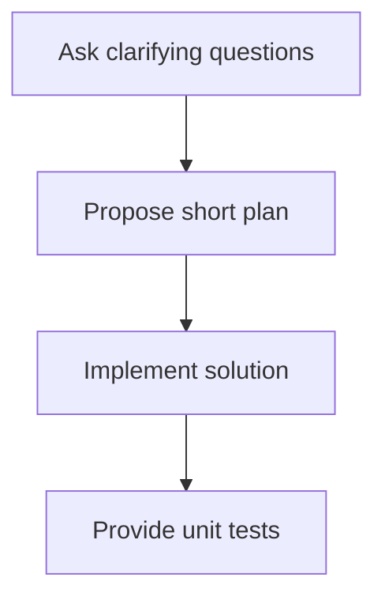

# Custom Chatmodes (Deprecated)

> ⚠️ **DEPRECATED**: As of October 2025, GitHub renamed "Chat Modes" to "Agents". See [GitHub's announcement](https://github.blog/changelog/2025-10-28-custom-agents-for-github-copilot/) for details. This directory is maintained for backward compatibility with VS Code, but **new development should use the `.github/agents/` directory** with the `.agent.md` extension.
>
> **Migration**: See [`.github/agents/README.md`](../agents/README.md) for the new agent format and examples.

This document explains how we author and maintain custom chat modes for Copilot in this repository. It is written for contributors who will create, review, or update chat-mode prompt documents. The goal is to describe what a custom chat mode is, how its prompt is structured, and best practices for crafting clear, safe, and testable instructions.

A custom chat mode is a bundled set of instructions, constraints, and examples that guide the language model to behave in a consistent, predictable way for a particular task or personality. Chat modes encode the expected role (persona), the step-by-step process the assistant should follow, the allowed output formats, and representative examples that demonstrate correct and incorrect behavior. By keeping these definitions explicit and version-controlled, teams can iterate on assistant behavior and reuse modes across projects.

## Chat modes in this repository

- [Code Reviewer](CodeReviewer.chatmode.md)
- [Developer](Developer.chatmode.md)
- [Documentation](Documentation.chatmode.md)
- [Planner](Planner.chatmode.md)
- [Tester](Tester.chatmode.md)

### SSOT and anti-duplication

This README is the Single Source of Truth (SSOT) for how to author chat modes in this repo. Individual `*.chatmode.md` files should avoid restating global policies or templates. Instead, link to:
- Central policies: `.github/copilot-instructions.md` (e.g., Quality & Coverage Policy, Branch/PR rules)
- Documentation rules: `.github/instructions/docs.instructions.md`
- Engineering guidelines: `docs/engineering/code-review-guidelines.md#code-review-checklist`

Chat modes may include small, mode-specific process steps or examples, but must not duplicate canonical templates or numeric policies.

## Official Docs

 - [Visual Studio Code chat mode docs](https://code.visualstudio.com/docs/copilot/customization/custom-chat-modes)

## Structure of a Custom Chat Mode prompt

A chat mode prompt document is a small, opinionated specification that the runtime combines with user messages to shape the assistant's behavior. The document is typically organized into a concise set of sections; the order matters because later sections can refine or constrain what came before. Below we describe the common sections and what they should contain.

### File name and location

Chat mode files are Markdown documents that use the `.chatmode.md` extension. For workspace-shared modes, place files in the `.github/chatmodes/` folder so collaborators can discover and use them; for personal modes put them in your VS Code profile folder. Name the file to match the mode's `name` frontmatter (kebab-case) for clarity, e.g. `code-synthesis.chatmode.md`.

You can create a new mode using the VS Code command palette (Chat: New Mode File) or via Configure Chat > Modes in the Chat view; the editor will scaffold a `.chatmode.md` file for you.

### Frontmatter (VS Code keys)

VS Code recognizes a small set of frontmatter keys that affect how modes behave in the editor and which tools are available. At minimum include these keys in the top YAML frontmatter so VS Code can display and configure the mode correctly:

- `description` (string): Brief description used as placeholder text in the chat input and as hover text in the mode picker.
- `tools` (list[string]): Names of tools or tool sets available for this mode (for example: `['codebase','fetch','search']`). Use the Configure Tools action to select valid tool names.
- `model` (string, optional): Model override for this mode. If omitted, the user's selected model is used.

Example frontmatter (VS Code-focused):

```yaml
---
description: Generate an implementation plan for a feature or refactor.
tools: ['codebase', 'search', 'fetch']
model: Claude Sonnet 4
---
```

Note: This repository also uses canonical metadata fields (see the "Frontmatter" section above) such as `name`, `version`, `owner`, and `required_sections` for tooling and CI; include both the VS Code keys and the repository keys when appropriate.

### Structure

0. Frontmatter
	- See canonical frontmatter fields above (description, tools, model).

1. Title and Purpose
	- A short title and one-sentence description of the mode's intent. This helps reviewers and users quickly understand when to select this mode.

2. Persona
	- A brief persona statement describes the assistant's role, tone, and domain expertise (for example: "senior backend engineer", "friendly onboarding coach"). Keep persona statements specific and actionable — list expectations like preferred tone (concise, empathetic), knowledge limits (do not invent facts), and any non-standard constraints (never produce code that runs shell commands). The persona section sets the high-level voice and guardrails.

3. Process / Step-by-step Instructions
	- A clear, numbered process definition tells the model how to approach requests. For example: (1) ask clarifying questions when input is ambiguous, (2) propose a short plan, (3) provide the implementation with inline comments, (4) include tests and usage examples. Make each step small and well-scoped so the model can follow them reliably.

4. Output Format and Constraints
	- Specify allowed file types, required headings, code-block languages, and any syntactic constraints (JSON schema, YAML keys, etc.). If the assistant must always include a "Next steps" section or never include images, state that here.

5. Reinforcement and Safety
	- Short reinforcement statements re-emphasize critical rules (safety, non-deceptive behavior, privacy constraints). These are concise lines such as: "If the user asks to break the law, refuse and offer alternatives." Place these near the top so they are harder to override.

6. Examples (Positive and Negative)
	- Include a handful of short, representative examples showing desirable assistant inputs/outputs and a few negative examples that show common failure modes to avoid. Positive examples demonstrate the preferred structure and tone; negative examples show what *not* to do and why. Examples are high-impact for aligning model behavior and should be realistic and varied.

7. Specialized Formatting Instructions
	- If the mode relies on structured outputs, include small templates or serializers for the formats you expect. Use separate subsections for common syntaxes:
	  - Markdown: show required heading structure, code block language markers, and any admonition or callout conventions.
	  - XML/HTML: provide a small example and required root elements or attributes; note encoding and escaping requirements.
	  - Mermaid/Diagrams: provide example Mermaid code blocks and limits on complexity or allowed diagram types.

8. Implementation Notes / Metadata
	- Short notes on how prompts are tested, versioning metadata, and links to related modes or tests. This is a place to record developer-facing details that don't need to be presented to the end user.

## Authoring and reinforcement techniques

When authoring a mode, think of the document as both instruction and curriculum. Use reinforcement lines to repeatedly and concisely restate the most important constraints: persona, safety rules, and output format. Keep reinforcement near the top and at key places in the prompt so that they remain salient even if the model is lengthy in its reasoning.

Prefer short, explicit process steps over long paragraphs. Processes should be actionable and testable: each step you write should be something you can check for in the assistant's output (for example, "includes a short plan with numbered steps" is testable, while "be helpful" is not).

## Examples: positive and negative

Good examples focus on minimal, complete interactions that show the model producing exactly the structure and tone you want. For example, a positive example for a code-synthesis mode might show a one-paragraph plan followed by a code block, inline comments, and a small unit test. A negative example might show the model producing unsourced facts, ignoring the required test, or using an informal tone when the persona requires formality.

When possible, annotate examples with brief rationale notes that explain why the example is good or bad — this helps reviewers and future authors understand the intent.

## Process definitions

Process definitions are the backbone of reliable behavior. Keep them short and ordered. If the mode requires branching behavior (for example: ask clarifying questions if missing info, otherwise proceed to implementation), make that branching explicit and provide small examples for each branch.

Make steps idempotent where possible: if a step says "provide a 3-point summary," the model should always attempt to produce that summary regardless of other output.

## Persona

Persona sections should be specific and constrained. Avoid vague descriptors like "be professional" without clarifying what that means in practice. Include permitted vocabulary, tone examples, and explicit forbidden behaviors (for example: "do not provide legal advice; instead, recommend consulting a licensed attorney").

## Markdown, XML, and Mermaid instructions

The following subsections explain how Markdown, XML/HTML, and Mermaid can be used inside a chat mode prompt to reinforce instructions, communicate structure, and make constraints testable. Each subsection has short examples of how to embed rules or templates that the assistant can follow and that tests can validate.

### Markdown

Use Markdown to make human-readable rules and templates explicit. Short lists, admonitions, and fenced code blocks are easy for reviewers to scan and for automated checks to parse. Practical uses:

- Present required output sections as Markdown headings (for example: "### Implementation", "### Tests", "### Next steps") so the assistant is more likely to include them verbatim.
- Include fenced code blocks that show exact formatting examples or templates (for example, a JSON schema or a small YAML template) and label them with the appropriate language for linter-driven checks.
- Use admonition-like bullets to reinforce constraints ("Note: do not include credentials", "Important: refuse illegal requests"). These short, repeated lines act as reinforcement anchors.

Example snippet to include in a mode prompt:

```markdown
### Output sections required
- Implementation
- Unit tests
- Usage examples

```json
{"name": "<string>", "version": "<semver>"}
```

Note how the headings and example code make assertions testable by simple text checks or JSON/YAML parsers.

### XML-style instruction tags (used inside prompts)

When we refer to XML in chat-mode prompts we mean XML-style instruction tags embedded in the prompt itself (instruction markup), not that the assistant should produce XML output. These tags act as clear, machine-parseable delimiters for instructions, constraints, or sections of the prompt. Use them to:

- Demarcate instruction blocks so the runtime or a validator can programmatically extract persona, safety rules, or step definitions.
- Explicitly label sections that must not be overwritten by the assistant (for example: <INSTRUCTIONS>...</INSTRUCTIONS> or <SAFETY>...</SAFETY>), which helps prevent accidental mixing of user content and control instructions.
- Provide attributes on tags to convey metadata (for example: <PLATFORM requiredBy="ci"/>) that downstream tooling can read and enforce.

Practical guidance:

- Keep tags simple and consistent. Prefer a small set of well-documented tags (for example: INSTRUCTIONS, PROCESS, EXAMPLES, METADATA).
- Use tags for segmentation only — avoid encoding complex logic inside attributes. Keep human-readable guidance in plain text near the tags.
- Treat tagged sections as authoritative: repeat critical safety rules inside a top-level <SAFETY> tag so they remain prominent.

Example (illustrative) prompt fragment:

```xml
<MODE name="code-synthesis">
	<PERSONA tone="concise">You are a senior backend engineer. Do not invent facts.</PERSONA>
	<SAFETY>Refuse illegal requests. Do not reveal secrets.</SAFETY>
	<PROCESS>
		<STEP>Ask clarifying questions when needed</STEP>
		<STEP>Propose a short plan</STEP>
		<STEP>Produce implementation and tests</STEP>
	</PROCESS>
</MODE>
```

Because these tags are embedded in the prompt itself they can be parsed by tools that validate modes, and they act as strong reinforcement anchors within the instruction text.

### Mermaid

Mermaid diagrams are excellent for making process steps, decision branches, or expected architecture explicit and visual. Use Mermaid to:

- Encode the mode's recommended process as a small flowchart (ask clarifying questions -> propose plan -> implement -> test). Visual flows reduce ambiguity and make it easier to verify that the assistant described the same sequence in text.
- Provide canonical node/edge labels and require the assistant to include the diagram or to produce equivalent text listing nodes in order.
- Limit complexity and specify allowed diagram types (flowchart, sequence) to keep outputs predictable and parseable.

Example snippet to include in a mode prompt:



As with other formats, include short instructions next to the diagram: "If any step is skipped, the assistant must explicitly say why." This makes the requirement both visible and testable.

## Maintenance and testing

Treat chat modes like code: add small unit-style tests that validate the most important behavior (for example, a test harness that checks the model output contains required sections, valid JSON, or passes a linter). Record where tests live and how to run them in the mode's metadata.

When updating a mode, increment its version and add a changelog entry explaining why the behavior changed. Keep negative examples up-to-date with observed failure modes.

---

If you're adding a new mode or editing an existing one, follow the repository's PR process: add the mode file under the appropriate folder, include examples and tests, and request review from the team listed in the contributing guidelines.

<!-- © Capgemini 2025 -->
