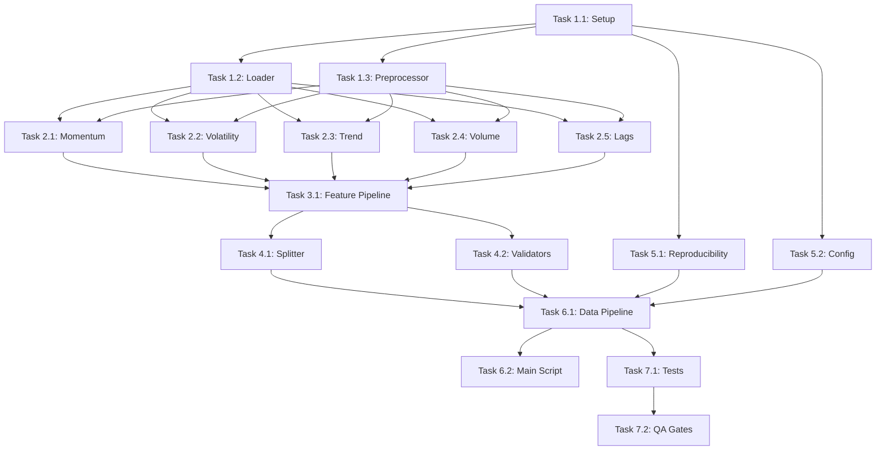

# Developer Tasks Plan: XAU/USD Trading Signal System
**ML Phase 1 - Data Pipeline & Feature Engineering**

**Document Version**: 1.0  
**Date Created**: December 5, 2025  
**Status**: Ready for Review  
**Phase**: MVP - Informational Signals (Phase 1)  
**Target Duration**: 4-6 weeks  

---

## 1. Executive Summary

This document decomposes the **ML Architecture & Implementation Plan** into concrete, actionable developer tasks for **Phase 1: Data Pipeline & Feature Engineering**. The focus is on:

1. ✅ Building robust **data loading and validation** infrastructure
2. ✅ Implementing **200+ technical indicators and features**
3. ✅ Creating **train/val/test data splits** (1-year XAU/USD data)
4. ✅ Establishing **feature validation and quality gates**
5. ✅ Setting up **reproducibility framework** (seeds, versioning)

**Success Criteria:**
- ✅ All data loading functions tested with **≥95% coverage**
- ✅ Feature engineering pipeline with **100% error handling**
- ✅ Dataset splits documented and validated
- ✅ CI/CD ready: Flake8, Black, isort, pytest passing
- ✅ Reproducible results with fixed random seeds

---

## 2. Project Scope & Constraints

### 2.1 Scope

**IN SCOPE (Phase 1):**
- Data loading from CSV files (`ml/data/*.csv`)
- Feature engineering pipeline (200+ technical indicators)
- Train/val/test split strategy (70%/15%/15%)
- Data quality validation and sanity checks
- Feature validation and statistical checks
- Reproducibility framework (seeds, versioning)

**OUT OF SCOPE (Phase 2+):**
- ML model training (XGBoost, LSTM)
- Model inference and deployment
- Real-time data streaming
- Integration with trading signals
- Dashboard and UI

### 2.2 Data Assets

**Available Data:**
- 20+ years of XAU/USD 1-minute OHLC data (2004-2025)
- Files: `ml/data/XAU_1m_data_*.csv`
- Columns: Date, Open, High, Low, Close, Volume

**Data Quality Requirements:**
- ✅ Missing values: < 0.1%
- ✅ Price consistency: High ≥ Low, High ≥ Open/Close, Low ≤ Open/Close
- ✅ Volume validation: Volume ≥ 0
- ✅ Chronological order: No gaps > 5 minutes during trading hours

### 2.3 Technical Requirements

**Python Version:** ≥ 3.9  
**Package Management:** pip + requirements.txt (or Poetry)  
**Testing Framework:** pytest + pytest-cov  
**Code Quality:** Black (formatter), Flake8 (linter), isort (imports)  

---

## 3. Task Breakdown

### 3.1 Foundation Tasks

#### Task 1.1: Project Structure & Environment Setup
**Complexity**: XS  
**Dependencies**: None  
**Owner**: Backend Dev / DevOps  

**Description:**
Set up the Python project structure, virtual environment, and development tools.

**Acceptance Criteria:**
- [ ] Virtual environment created and documented (`venv/` or Poetry)
- [ ] `requirements.txt` created with all dependencies (pandas, numpy, scikit-learn, etc.)
- [ ] `.env.example` created with configuration template
- [ ] Black, Flake8, isort configured in project root
- [ ] pytest.ini configured with coverage thresholds (95%+)
- [ ] README updated with setup instructions
- [ ] CI/CD configuration ready (GitHub Actions stub)

**Implementation Notes:**
```python
# Key dependencies to include:
pandas>=2.0.0
numpy>=1.24.0
scikit-learn>=1.3.0
matplotlib>=3.7.0
seaborn>=0.12.0
statsmodels>=0.14.0
pytest>=7.4.0
pytest-cov>=4.1.0
black>=23.0.0
flake8>=6.0.0
isort>=5.12.0
```

**Testing Strategy:**
- Verify virtual environment activates
- Verify all imports work
- Run `black --check`, `flake8`, `isort --check` on empty project

---

#### Task 1.2: Data Loading Module (`ml/src/data/loader.py`)
**Complexity**: S  
**Dependencies**: Task 1.1  
**Owner**: Data Engineer / ML Engineer  

**Description:**
Implement robust data loading functions for XAU/USD CSV files with validation.

**Acceptance Criteria:**
- [ ] Function `load_csv(file_path: str) -> pd.DataFrame`
  - Reads CSV file
  - Validates column presence: Date, Open, High, Low, Close, Volume
  - Converts Date to datetime
  - Returns DataFrame or raises ValueError with clear message
  
- [ ] Function `validate_price_consistency(df: pd.DataFrame) -> bool`
  - Checks: High ≥ Low
  - Checks: High ≥ max(Open, Close)
  - Checks: Low ≤ min(Open, Close)
  - Returns True if all checks pass, else logs/raises
  
- [ ] Function `validate_volume(df: pd.DataFrame) -> bool`
  - Checks: Volume ≥ 0
  - Checks: No volume NaN except expected gaps
  - Returns True if valid
  
- [ ] Function `load_all_years(data_dir: str, years: list[int]) -> pd.DataFrame`
  - Loads multiple CSV files by year
  - Concatenates and sorts by Date
  - Validates no gaps > 5 minutes during trading hours (07:00-23:00 Polish time)
  - Returns concatenated DataFrame
  
- [ ] Unit tests with ≥95% coverage
  - Mock data for edge cases (missing columns, invalid prices, gaps)
  - Test error handling and exceptions
  
- [ ] Type hints on all functions
- [ ] Docstrings (Google/NumPy style)
- [ ] Error handling: custom exceptions (e.g., `DataValidationError`)

**Implementation Notes:**
```python
# ml/src/data/loader.py structure:
import pandas as pd
import numpy as np
from pathlib import Path
import logging

class DataValidationError(Exception):
    """Raised when data validation fails."""
    pass

def load_csv(file_path: str) -> pd.DataFrame:
    """Load and validate XAU/USD CSV file."""
    # Implementation
    
def validate_price_consistency(df: pd.DataFrame) -> bool:
    """Check price OHLC consistency."""
    # Implementation
    
def validate_volume(df: pd.DataFrame) -> bool:
    """Check volume validity."""
    # Implementation
    
def load_all_years(data_dir: str, years: list[int]) -> pd.DataFrame:
    """Load and concatenate yearly CSV files."""
    # Implementation
```

**Testing Strategy:**
- Unit tests: `ml/tests/test_loader.py`
- Fixtures: sample CSV files in `ml/tests/fixtures/`
- Edge cases: missing columns, invalid prices, duplicate rows
- Coverage: ≥95%

---

#### Task 1.3: Data Preprocessing Module (`ml/src/data/preprocessor.py`)
**Complexity**: S  
**Dependencies**: Task 1.2  
**Owner**: Data Engineer / ML Engineer  

**Description:**
Implement data cleaning, resampling, and normalization functions.

**Acceptance Criteria:**
- [ ] Function `handle_missing_values(df: pd.DataFrame, method: str = 'forward_fill') -> pd.DataFrame`
  - Options: 'forward_fill', 'interpolate', 'drop'
  - Returns cleaned DataFrame
  - Logs number of values imputed
  
- [ ] Function `resample_to_5min(df: pd.DataFrame) -> pd.DataFrame`
  - Ensures all 5-minute intervals present
  - Fills gaps with OHLC logic (e.g., Close becomes Open for next candle)
  - Returns resampled DataFrame
  
- [ ] Function `remove_outliers(df: pd.DataFrame, column: str, method: str = 'iqr', threshold: float = 3.0) -> pd.DataFrame`
  - Methods: 'iqr', 'zscore'
  - Returns DataFrame with outliers flagged/removed
  - Logs outlier counts
  
- [ ] Function `normalize_features(df: pd.DataFrame, columns: list[str], method: str = 'minmax') -> tuple[pd.DataFrame, dict]`
  - Methods: 'minmax', 'zscore'
  - Returns normalized DataFrame + scaler params (for inverse transform)
  - Scaler params saved for use in inference
  
- [ ] Unit tests with ≥95% coverage
- [ ] Type hints and docstrings
- [ ] Error handling and logging

**Implementation Notes:**
```python
# ml/src/data/preprocessor.py structure:
import pandas as pd
import numpy as np
from sklearn.preprocessing import MinMaxScaler, StandardScaler
import logging

def handle_missing_values(df: pd.DataFrame, method: str = 'forward_fill') -> pd.DataFrame:
    """Handle missing values in price data."""
    # Implementation
    
def resample_to_5min(df: pd.DataFrame) -> pd.DataFrame:
    """Resample to 5-minute candles."""
    # Implementation
    
def remove_outliers(df: pd.DataFrame, column: str, method: str = 'iqr', threshold: float = 3.0) -> pd.DataFrame:
    """Remove outliers from feature columns."""
    # Implementation
    
def normalize_features(df: pd.DataFrame, columns: list[str], method: str = 'minmax') -> tuple[pd.DataFrame, dict]:
    """Normalize features for ML models."""
    # Implementation
```

---

### 3.2 Feature Engineering Tasks

#### Task 2.1: Momentum Indicators (`ml/src/analysis/momentum.py`)
**Complexity**: M  
**Dependencies**: Task 1.3  
**Owner**: ML Engineer / Data Scientist  

**Description:**
Implement momentum-based technical indicators.

**Acceptance Criteria:**
- [ ] Function `calculate_rsi(df: pd.DataFrame, period: int = 14) -> pd.Series`
  - Relative Strength Index
  - Returns 0-100 values
  - NaN for first `period` rows
  
- [ ] Function `calculate_macd(df: pd.DataFrame, fast: int = 12, slow: int = 26, signal: int = 9) -> tuple[pd.Series, pd.Series, pd.Series]`
  - MACD line, Signal line, Histogram
  - Returns (macd, signal, histogram)
  
- [ ] Function `calculate_stochastic(df: pd.DataFrame, k_period: int = 14, d_period: int = 3) -> tuple[pd.Series, pd.Series]`
  - Stochastic Oscillator
  - Returns (K, D)
  
- [ ] Function `calculate_momentum(df: pd.DataFrame, period: int = 10) -> pd.Series`
  - Price momentum (change over period)
  
- [ ] Function `calculate_roc(df: pd.DataFrame, period: int = 12) -> pd.Series`
  - Rate of Change
  
- [ ] Unit tests with ≥95% coverage
- [ ] Validation: compare outputs to TA-Lib or known values
- [ ] Type hints and docstrings

**Implementation Notes:**
```python
# ml/src/analysis/momentum.py structure:
import pandas as pd
import numpy as np

def calculate_rsi(df: pd.DataFrame, period: int = 14) -> pd.Series:
    """Calculate Relative Strength Index."""
    # Implementation
    
def calculate_macd(...) -> tuple[pd.Series, pd.Series, pd.Series]:
    """Calculate MACD indicator."""
    # Implementation
    
# ... other functions
```

---

#### Task 2.2: Volatility Indicators (`ml/src/analysis/volatility.py`)
**Complexity**: M  
**Dependencies**: Task 1.3  
**Owner**: ML Engineer / Data Scientist  

**Description:**
Implement volatility-based technical indicators.

**Acceptance Criteria:**
- [ ] Function `calculate_atr(df: pd.DataFrame, period: int = 14) -> pd.Series`
  - Average True Range
  
- [ ] Function `calculate_bollinger_bands(df: pd.DataFrame, period: int = 20, num_std: float = 2.0) -> tuple[pd.Series, pd.Series, pd.Series]`
  - Returns (upper, middle, lower)
  
- [ ] Function `calculate_std_dev(df: pd.DataFrame, period: int = 20) -> pd.Series`
  - Standard deviation of close prices
  
- [ ] Function `calculate_realized_volatility(df: pd.DataFrame, period: int = 20) -> pd.Series`
  - Volatility from returns
  
- [ ] Unit tests with ≥95% coverage
- [ ] Type hints and docstrings

---

#### Task 2.3: Trend Indicators (`ml/src/analysis/trend.py`)
**Complexity**: M  
**Dependencies**: Task 1.3  
**Owner**: ML Engineer / Data Scientist  

**Description:**
Implement trend-based technical indicators.

**Acceptance Criteria:**
- [ ] Function `calculate_sma(df: pd.DataFrame, period: int = 20) -> pd.Series`
  - Simple Moving Average
  
- [ ] Function `calculate_ema(df: pd.DataFrame, period: int = 20) -> pd.Series`
  - Exponential Moving Average
  
- [ ] Function `calculate_adx(df: pd.DataFrame, period: int = 14) -> tuple[pd.Series, pd.Series, pd.Series]`
  - ADX + DI+ + DI-
  - Returns (adx, di_plus, di_minus)
  
- [ ] Function `calculate_aroon(df: pd.DataFrame, period: int = 25) -> tuple[pd.Series, pd.Series]`
  - Aroon Up & Aroon Down
  
- [ ] Unit tests with ≥95% coverage
- [ ] Type hints and docstrings

---

#### Task 2.4: Volume & Microstructure (`ml/src/analysis/volume.py`)
**Complexity**: M  
**Dependencies**: Task 1.3  
**Owner**: ML Engineer / Data Scientist  

**Description:**
Implement volume and market microstructure indicators.

**Acceptance Criteria:**
- [ ] Function `calculate_obv(df: pd.DataFrame) -> pd.Series`
  - On-Balance Volume
  
- [ ] Function `calculate_vwap(df: pd.DataFrame, period: int = 20) -> pd.Series`
  - Volume-Weighted Average Price
  
- [ ] Function `calculate_mfi(df: pd.DataFrame, period: int = 14) -> pd.Series`
  - Money Flow Index
  
- [ ] Function `calculate_volume_sma(df: pd.DataFrame, period: int = 20) -> pd.Series`
  - Volume moving average
  
- [ ] Unit tests with ≥95% coverage
- [ ] Type hints and docstrings

---

#### Task 2.5: Lag & Autocorrelation Features (`ml/src/analysis/lags.py`)
**Complexity**: S  
**Dependencies**: Task 1.3  
**Owner**: ML Engineer / Data Scientist  

**Description:**
Implement lag-based and autocorrelation features for time-series.

**Acceptance Criteria:**
- [ ] Function `create_lagged_features(df: pd.DataFrame, column: str, lags: list[int]) -> pd.DataFrame`
  - Creates lagged versions of column
  - Example: lags=[1, 2, 3, 5, 10] for 1m, 2m, 3m, 5m, 10m lags
  
- [ ] Function `calculate_autocorrelation(df: pd.DataFrame, column: str, max_lag: int = 20) -> pd.DataFrame`
  - Autocorrelation coefficients for given column
  
- [ ] Function `create_time_features(df: pd.DataFrame) -> pd.DataFrame`
  - Hour of day (0-23)
  - Day of week (0-6)
  - Is_trading_hours (bool)
  - Is_london_session, Is_us_session (bool)
  
- [ ] Unit tests with ≥95% coverage
- [ ] Type hints and docstrings

---

### 3.3 Feature Integration Tasks

#### Task 3.1: Master Feature Engineering Pipeline (`ml/src/data/feature_engineer.py`)
**Complexity**: L  
**Dependencies**: Tasks 2.1 - 2.5  
**Owner**: ML Engineer / Lead  

**Description:**
Integrate all indicators into a single, production-ready feature engineering pipeline.

**Acceptance Criteria:**
- [ ] Class `FeatureEngineer`
  - **Constructor**: `__init__(self, df: pd.DataFrame, config: dict = None)`
  - **Method**: `add_momentum_features(self) -> Self` (chainable)
  - **Method**: `add_volatility_features(self) -> Self`
  - **Method**: `add_trend_features(self) -> Self`
  - **Method**: `add_volume_features(self) -> Self`
  - **Method**: `add_lag_features(self, lags: list[int] = [1, 2, 3, 5, 10]) -> Self`
  - **Method**: `add_time_features(self) -> Self`
  - **Method**: `get_features(self) -> pd.DataFrame` (returns engineered features)
  - **Method**: `get_feature_names(self) -> list[str]`
  - **Method**: `get_feature_types(self) -> dict[str, str]` (returns {'feature': 'type'})
  
- [ ] Configuration file: `ml/src/config/feature_config.yaml`
  ```yaml
  feature_engineering:
    momentum:
      enabled: true
      rsi_period: 14
      macd_fast: 12
      macd_slow: 26
      macd_signal: 9
    volatility:
      enabled: true
      atr_period: 14
      bb_period: 20
      bb_std: 2.0
    trend:
      enabled: true
      sma_periods: [20, 50, 200]
      ema_periods: [12, 26]
      adx_period: 14
    volume:
      enabled: true
      obv_enabled: true
      mfi_period: 14
    lags:
      enabled: true
      lag_periods: [1, 2, 3, 5, 10, 20, 60]
    time:
      enabled: true
  ```
  
- [ ] Function `engineer_features(df: pd.DataFrame, config_path: str) -> pd.DataFrame`
  - High-level API for feature engineering
  - Returns DataFrame with 200+ features
  
- [ ] Logging and monitoring
  - Log number of features created
  - Log processing time
  - Log any NaN values in features
  
- [ ] Unit tests with ≥95% coverage
- [ ] Integration tests with sample data
- [ ] Type hints and docstrings

**Implementation Notes:**
```python
# ml/src/data/feature_engineer.py structure:
import pandas as pd
import numpy as np
from pathlib import Path
import yaml
import logging
from ml.src.analysis import momentum, volatility, trend, volume, lags

class FeatureEngineer:
    """Master feature engineering pipeline."""
    
    def __init__(self, df: pd.DataFrame, config: dict = None):
        self.df = df.copy()
        self.features = self.df[['Date', 'Close']].copy()
        self.config = config or self._load_default_config()
        self.feature_names = []
    
    def add_momentum_features(self) -> 'FeatureEngineer':
        """Add momentum indicators."""
        # Implementation
        return self
    
    def add_volatility_features(self) -> 'FeatureEngineer':
        """Add volatility indicators."""
        # Implementation
        return self
    
    # ... other methods
    
    def get_features(self) -> pd.DataFrame:
        """Return engineered features."""
        return self.features
```

---

### 3.4 Data Split & Validation Tasks

#### Task 4.1: Train/Val/Test Split Strategy (`ml/src/data/splitter.py`)
**Complexity**: S  
**Dependencies**: Task 1.3  
**Owner**: Data Engineer / ML Engineer  

**Description:**
Implement time-series-aware data splitting with proper ordering and validation.

**Acceptance Criteria:**
- [ ] Function `split_data(df: pd.DataFrame, split_ratio: tuple = (0.7, 0.15, 0.15), random_state: int = 42) -> tuple[pd.DataFrame, pd.DataFrame, pd.DataFrame]`
  - **Input**: Full dataset (sorted by date)
  - **Logic**: Chronological split (no shuffling for time-series)
  - **Returns**: (train_df, val_df, test_df)
  - **Example**: 20 years total → 14 years train, 3 years val, 3 years test
  
- [ ] Function `validate_splits(train: pd.DataFrame, val: pd.DataFrame, test: pd.DataFrame) -> bool`
  - Checks no date overlap between train/val/test
  - Checks chronological ordering within each split
  - Checks sufficient samples (min 1000 rows per split)
  - Returns True if valid
  
- [ ] Function `get_split_info(train: pd.DataFrame, val: pd.DataFrame, test: pd.DataFrame) -> dict`
  - Returns dictionary with statistics:
    ```python
    {
        'train': {'start_date': ..., 'end_date': ..., 'rows': ...},
        'val': {'start_date': ..., 'end_date': ..., 'rows': ...},
        'test': {'start_date': ..., 'end_date': ..., 'rows': ...},
    }
    ```
  
- [ ] Unit tests with ≥95% coverage
- [ ] Type hints and docstrings

---

#### Task 4.2: Feature Validation Module (`ml/src/data/validators.py`)
**Complexity**: M  
**Dependencies**: Task 3.1  
**Owner**: QA / ML Engineer  

**Description:**
Implement feature quality validation and sanity checks.

**Acceptance Criteria:**
- [ ] Function `check_nan_values(df: pd.DataFrame, max_nan_ratio: float = 0.05) -> dict`
  - Checks NaN ratio for each feature
  - Returns {'feature': nan_count, ...}
  - Raises error if any feature exceeds max_nan_ratio
  
- [ ] Function `check_feature_variance(df: pd.DataFrame, min_variance: float = 0.01) -> dict`
  - Checks variance for each feature
  - Returns {'feature': variance, ...}
  - Flags low-variance features
  
- [ ] Function `check_feature_correlation(df: pd.DataFrame, max_correlation: float = 0.95) -> dict`
  - Checks correlation matrix
  - Returns highly correlated feature pairs
  - Warns about redundant features
  
- [ ] Function `check_feature_distribution(df: pd.DataFrame) -> dict`
  - Checks for skewness, kurtosis
  - Flags highly skewed distributions
  
- [ ] Function `validate_feature_ranges(df: pd.DataFrame, ranges: dict) -> bool`
  - Validates each feature is within expected range
  - Example: RSI should be 0-100
  
- [ ] Function `full_validation_report(df: pd.DataFrame) -> dict`
  - Runs all checks
  - Returns comprehensive validation report
  
- [ ] Unit tests with ≥95% coverage
- [ ] Type hints and docstrings

---

### 3.5 Reproducibility & Configuration Tasks

#### Task 5.1: Reproducibility Framework (`ml/src/config/reproducibility.py`)
**Complexity**: S  
**Dependencies**: Task 1.1  
**Owner**: ML Engineer  

**Description:**
Implement reproducibility mechanisms (random seeds, versioning).

**Acceptance Criteria:**
- [ ] Function `set_random_seeds(seed: int = 42) -> None`
  - Sets seeds for: numpy, random, pandas
  - Ensures reproducible results
  
- [ ] Function `get_data_version() -> str`
  - Returns data version/hash (based on input CSV files)
  - Used for tracking data lineage
  
- [ ] Function `get_feature_version() -> str`
  - Returns feature engineering version
  - Incremented when feature definitions change
  
- [ ] Class `ReproducibilityConfig`
  - Stores: random_seed, data_version, feature_version, timestamp
  - Method `to_dict()` and `to_json()`
  - Used for experiment tracking
  
- [ ] Unit tests with ≥95% coverage
- [ ] Type hints and docstrings

---

#### Task 5.2: Configuration Management (`ml/src/config/config.py`)
**Complexity**: S  
**Dependencies**: Task 1.1  
**Owner**: DevOps / ML Engineer  

**Description:**
Implement centralized configuration management.

**Acceptance Criteria:**
- [ ] Configuration file: `ml/src/config/defaults.yaml`
  ```yaml
  data:
    input_dir: "ml/data/"
    output_dir: "ml/processed/"
    years: [2024]  # Start with 1 year
  
  splits:
    train_ratio: 0.7
    val_ratio: 0.15
    test_ratio: 0.15
  
  features:
    config_file: "ml/src/config/feature_config.yaml"
  
  reproducibility:
    random_seed: 42
  ```
  
- [ ] Function `load_config(config_path: str) -> dict`
  - Loads YAML config
  - Validates required fields
  - Raises ConfigError if invalid
  
- [ ] Function `get_config(key: str) -> Any`
  - Access config values by dot notation (e.g., "data.input_dir")
  
- [ ] Unit tests with ≥95% coverage
- [ ] Type hints and docstrings

---

### 3.6 Integration & End-to-End Tasks

#### Task 6.1: Data Pipeline Integration (`ml/src/pipelines/data_pipeline.py`)
**Complexity**: L  
**Dependencies**: Tasks 1.2, 1.3, 3.1, 4.1, 4.2  
**Owner**: ML Engineer / Lead  

**Description:**
Integrate all components into a complete, reusable data pipeline.

**Acceptance Criteria:**
- [ ] Class `DataPipeline`
  - **Constructor**: `__init__(self, config_path: str)`
  - **Method**: `load_data(self) -> pd.DataFrame`
  - **Method**: `preprocess(self, df: pd.DataFrame) -> pd.DataFrame`
  - **Method**: `engineer_features(self, df: pd.DataFrame) -> pd.DataFrame`
  - **Method**: `split_data(self, df: pd.DataFrame) -> tuple[pd.DataFrame, pd.DataFrame, pd.DataFrame]`
  - **Method**: `validate_output(self, train: pd.DataFrame, val: pd.DataFrame, test: pd.DataFrame) -> bool`
  - **Method**: `run_full_pipeline(self) -> dict`
    - Returns: `{'train': df, 'val': df, 'test': df, 'metadata': {...}}`
  
- [ ] Method `run_full_pipeline()` that orchestrates:
  1. Load data (Task 1.2)
  2. Preprocess (Task 1.3)
  3. Engineer features (Task 3.1)
  4. Split data (Task 4.1)
  5. Validate features (Task 4.2)
  6. Validate splits (Task 4.1)
  7. Return results + metadata
  
- [ ] Logging at each pipeline step
- [ ] Error handling with descriptive messages
- [ ] Unit tests with ≥95% coverage
- [ ] Integration tests with full pipeline
- [ ] Type hints and docstrings

**Implementation Notes:**
```python
# ml/src/pipelines/data_pipeline.py structure:
import pandas as pd
from ml.src.data.loader import load_all_years
from ml.src.data.preprocessor import handle_missing_values, resample_to_5min
from ml.src.data.feature_engineer import engineer_features
from ml.src.data.splitter import split_data, validate_splits
from ml.src.data.validators import full_validation_report

class DataPipeline:
    """Complete data pipeline from raw data to ML-ready datasets."""
    
    def __init__(self, config_path: str):
        # Load config
        self.config = load_config(config_path)
        self.logger = logging.getLogger(__name__)
    
    def load_data(self) -> pd.DataFrame:
        """Load raw data."""
        # Implementation
    
    def run_full_pipeline(self) -> dict:
        """Execute complete pipeline."""
        # Implementation
        return {
            'train': train_df,
            'val': val_df,
            'test': test_df,
            'metadata': {...}
        }
```

---

#### Task 6.2: Main Script & Execution (`ml/main.py`)
**Complexity**: S  
**Dependencies**: Task 6.1  
**Owner**: ML Engineer  

**Description:**
Create executable main script for running the full pipeline.

**Acceptance Criteria:**
- [ ] Script `ml/main.py`
  ```python
  import logging
  from ml.src.pipelines.data_pipeline import DataPipeline
  
  if __name__ == "__main__":
      logging.basicConfig(level=logging.INFO)
      pipeline = DataPipeline("ml/src/config/defaults.yaml")
      results = pipeline.run_full_pipeline()
      
      print("✅ Pipeline completed successfully!")
      print(f"Train: {results['train'].shape}")
      print(f"Val: {results['val'].shape}")
      print(f"Test: {results['test'].shape}")
  ```
  
- [ ] Executable with: `python ml/main.py`
- [ ] Outputs results to `ml/processed/`
- [ ] Logs to console and file
- [ ] Exit code 0 on success, 1 on failure

---

### 3.7 Testing & Quality Assurance Tasks

#### Task 7.1: Unit Test Suite (`ml/tests/`)
**Complexity**: L  
**Dependencies**: All previous tasks  
**Owner**: QA / Test Engineer  

**Description:**
Create comprehensive unit test suite for all modules.

**Acceptance Criteria:**
- [ ] Test files created for each module:
  - `ml/tests/test_loader.py` (Task 1.2)
  - `ml/tests/test_preprocessor.py` (Task 1.3)
  - `ml/tests/test_momentum.py` (Task 2.1)
  - `ml/tests/test_volatility.py` (Task 2.2)
  - `ml/tests/test_trend.py` (Task 2.3)
  - `ml/tests/test_volume.py` (Task 2.4)
  - `ml/tests/test_lags.py` (Task 2.5)
  - `ml/tests/test_feature_engineer.py` (Task 3.1)
  - `ml/tests/test_splitter.py` (Task 4.1)
  - `ml/tests/test_validators.py` (Task 4.2)
  - `ml/tests/test_data_pipeline.py` (Task 6.1)
  
- [ ] Test fixtures directory: `ml/tests/fixtures/`
  - Sample CSV files
  - Sample DataFrames
  - Mock data for edge cases
  
- [ ] Coverage ≥95% for all modules
  - Run: `pytest --cov=ml/src ml/tests/`
  - Coverage report in HTML format
  
- [ ] All tests pass (green CI/CD)
- [ ] Type hints validated with mypy (optional)

---

#### Task 7.2: Code Quality Gates (`ml/`)
**Complexity**: S  
**Dependencies**: Task 1.1, Task 7.1  
**Owner**: DevOps / QA  

**Description:**
Configure and enforce code quality standards.

**Acceptance Criteria:**
- [ ] Black formatting
  - Config in `pyproject.toml` or `.flake8`
  - Run: `black ml/src ml/tests`
  - CI checks: `black --check ml/src ml/tests`
  
- [ ] Flake8 linting
  - Config in `.flake8`
  - Run: `flake8 ml/src ml/tests`
  - Enforce: max-line-length=100, ignore E501 if needed
  
- [ ] isort import sorting
  - Config in `pyproject.toml`
  - Run: `isort ml/src ml/tests`
  - CI checks: `isort --check ml/src ml/tests`
  
- [ ] pytest test discovery
  - Run: `pytest ml/tests/`
  - CI configuration ready
  
- [ ] GitHub Actions workflow (stub)
  - `.github/workflows/python-ml-ci.yml`
  - Runs: isort, black, flake8, pytest + coverage
  - Fails if coverage < 95%

---

## 4. Task Dependencies & Critical Path

### 4.1 Dependency Graph



### 4.2 Critical Path

**Longest dependency chain (~4 weeks):**
```
Task 1.1 (Setup) 
  → Task 1.2 (Loader) 
  → Task 2.x (Indicators) 
  → Task 3.1 (Feature Pipeline)
  → Task 6.1 (Data Pipeline)
  → Task 6.2 (Main Script)
  → Task 7.1 (Tests)
  → Task 7.2 (QA)
```

### 4.3 Parallelization Opportunities

**Can run in parallel (no dependencies on each other):**
- Task 2.1, 2.2, 2.3, 2.4, 2.5 (all indicator modules)
- Task 5.1, 5.2 (config and reproducibility)

**Recommended parallelization strategy:**
- **Week 1**: Task 1.1, 1.2, 1.3 (setup + loading + preprocessing)
- **Week 2**: Tasks 2.1-2.5 (all 5 indicator modules in parallel)
- **Week 3**: Task 3.1 (feature pipeline), Task 4.1-4.2 (splits + validators), Task 5.1-5.2 (config)
- **Week 4**: Task 6.1, 6.2, 7.1 (integration + tests)
- **Week 5**: Task 7.2 (QA gates + refinement)

---

## 5. Success Criteria & Acceptance Tests

### 5.1 Functional Acceptance Criteria

✅ **Data Loading**
- All 20 CSV files load successfully
- Data integrity validated (OHLC consistency, no gaps > 5min)
- Sample data: `df.shape == (20+ million rows, 6 columns)`

✅ **Feature Engineering**
- 200+ features successfully engineered from raw OHLC
- All features computed without errors
- Feature validation report shows:
  - No NaN values > 5%
  - Variance > 0.01 for all features
  - Correlation < 0.95 between features

✅ **Data Splitting**
- Train/val/test split created: 70%/15%/15%
- No date overlap between splits
- Chronological ordering maintained within splits

✅ **Reproducibility**
- Random seeds set globally
- Identical results on re-run: `train == train'`
- Version tracking: data_version, feature_version documented

✅ **Code Quality**
- 100% Black formatted
- Flake8 score: 0 errors/warnings
- isort: imports properly organized
- All type hints present

✅ **Test Coverage**
- ≥95% line/branch coverage across ml/src
- 100% coverage of error paths
- All tests pass

### 5.2 Non-Functional Acceptance Criteria

✅ **Performance**
- Data loading: < 30 seconds for 20 CSV files (20M+ rows)
- Feature engineering: < 5 minutes for full dataset
- Full pipeline: < 10 minutes end-to-end

✅ **Maintainability**
- All functions have docstrings (Google style)
- All classes documented
- README updated with usage examples
- Configuration files clearly documented

✅ **Reliability**
- Error handling for all edge cases (missing data, invalid ranges, etc.)
- Logging at DEBUG/INFO/WARNING levels
- Graceful failure with clear error messages

---

## 6. Testing Strategy

### 6.1 Test Levels

| Level | Scope | Framework | Coverage Target |
|-------|-------|-----------|-----------------|
| **Unit** | Individual functions | pytest | ≥95% |
| **Integration** | Feature modules | pytest | ≥85% |
| **End-to-End** | Full pipeline | pytest + fixtures | ≥80% |
| **Data Quality** | Feature validation | custom validators | 100% |

### 6.2 Test Data Strategy

- **Sample Data**: Small CSV files in `ml/tests/fixtures/` (1-month worth)
- **Edge Cases**: 
  - Missing values (NaN, gaps)
  - Outliers (extreme prices)
  - Empty files
  - Invalid data types
- **Performance**: Sample runs with 1 year data to validate performance

### 6.3 Quality Gates

```bash
# Run all checks:
black --check ml/src ml/tests
flake8 ml/src ml/tests
isort --check ml/src ml/tests
pytest --cov=ml/src --cov-report=html ml/tests/
```

**Must pass before merge:**
- ✅ Black: 0 formatting violations
- ✅ Flake8: 0 linting errors
- ✅ isort: All imports sorted
- ✅ pytest: All tests pass
- ✅ Coverage: ≥95%

---

## 7. Risk Assessment & Mitigation

| Risk | Impact | Probability | Mitigation |
|------|--------|-------------|-----------|
| **Data quality issues** (gaps, NaNs) | HIGH | MEDIUM | Task 1.2: comprehensive validation; Task 4.2: sanity checks |
| **Feature engineering complexity** | HIGH | MEDIUM | Start with 50 features, expand iteratively; code reviews |
| **Memory constraints** (20M rows) | MEDIUM | LOW | Process data in chunks if needed; profile memory usage |
| **Reproducibility issues** | MEDIUM | LOW | Task 5.1: strict seed management; version tracking |
| **Test coverage gaps** | MEDIUM | LOW | Task 7.1: comprehensive test suite; CI/CD gates |
| **Performance bottlenecks** | MEDIUM | MEDIUM | Benchmark each task; profile critical paths |

---

## 8. Timeline & Resource Allocation

### 8.1 Recommended Schedule

| Week | Tasks | Assignee(s) | Status |
|------|-------|------------|--------|
| **Week 1** | 1.1, 1.2, 1.3 | Backend Dev + Data Eng | Setup + Data Loading |
| **Week 2** | 2.1-2.5 (parallel) | ML Engineer (x2-3) | Indicator Implementation |
| **Week 3** | 3.1, 4.1, 4.2, 5.1, 5.2 | ML Engineer + QA | Integration + Validation |
| **Week 4** | 6.1, 6.2, 7.1 (parallel) | ML Engineer + QA | Pipeline + Tests |
| **Week 5** | 7.2 + refinement | QA + All team | Final QA + Documentation |

### 8.2 Resource Requirements

- **ML Engineer**: 80% allocation (4-5 weeks)
- **Data Engineer**: 60% allocation (1-2 weeks)
- **QA/Test Engineer**: 50% allocation (2-3 weeks)
- **DevOps**: 20% allocation (1 week, for CI/CD)
- **Backend Dev**: 30% allocation (1 week, for setup)

---

## 9. Deliverables Checklist

### 9.1 Code Deliverables

- [ ] `ml/src/data/loader.py` - Data loading module
- [ ] `ml/src/data/preprocessor.py` - Data preprocessing
- [ ] `ml/src/analysis/momentum.py` - Momentum indicators
- [ ] `ml/src/analysis/volatility.py` - Volatility indicators
- [ ] `ml/src/analysis/trend.py` - Trend indicators
- [ ] `ml/src/analysis/volume.py` - Volume indicators
- [ ] `ml/src/analysis/lags.py` - Lag features
- [ ] `ml/src/data/feature_engineer.py` - Master feature engineering
- [ ] `ml/src/data/splitter.py` - Train/val/test splitting
- [ ] `ml/src/data/validators.py` - Feature validation
- [ ] `ml/src/config/reproducibility.py` - Reproducibility framework
- [ ] `ml/src/config/config.py` - Configuration management
- [ ] `ml/src/pipelines/data_pipeline.py` - Complete pipeline
- [ ] `ml/main.py` - Main execution script

### 9.2 Configuration Deliverables

- [ ] `ml/src/config/defaults.yaml` - Default configuration
- [ ] `ml/src/config/feature_config.yaml` - Feature configuration
- [ ] `.github/workflows/python-ml-ci.yml` - CI/CD pipeline
- [ ] `requirements.txt` - Python dependencies
- [ ] `.env.example` - Environment variables template

### 9.3 Test Deliverables

- [ ] `ml/tests/test_loader.py` - Loader tests
- [ ] `ml/tests/test_preprocessor.py` - Preprocessor tests
- [ ] `ml/tests/test_*_indicators.py` - Indicator tests (5 modules)
- [ ] `ml/tests/test_feature_engineer.py` - Feature pipeline tests
- [ ] `ml/tests/test_splitter.py` - Splitter tests
- [ ] `ml/tests/test_validators.py` - Validator tests
- [ ] `ml/tests/test_data_pipeline.py` - Integration tests
- [ ] `ml/tests/fixtures/` - Test fixtures and sample data
- [ ] Coverage reports in HTML format

### 9.4 Documentation Deliverables

- [ ] README updated with setup/usage instructions
- [ ] Docstrings for all modules (Google style)
- [ ] Architecture documentation (if needed)
- [ ] Feature engineering documentation
- [ ] Test coverage reports
- [ ] This plan document (developer tasks)

---

## 10. Approval & Sign-off

**Plan Author**: Python/ML Planner Agent  
**Date Created**: December 5, 2025  
**Status**: 🔄 Ready for Review  

**Required Approvals:**
- [ ] ML/Data Science Lead
- [ ] Backend Lead
- [ ] QA Lead
- [ ] Project Manager

**Approval Signature**: ________________________ Date: __________

---

**Notes for Reviewer:**
- This plan decomposes the ML Architecture into actionable developer tasks.
- Tasks are organized by phase: foundation → indicators → integration → testing.
- Parallelization opportunities identified for 5 indicator modules.
- Comprehensive testing strategy with ≥95% coverage targets.
- All acceptance criteria defined for objective completion measurement.

